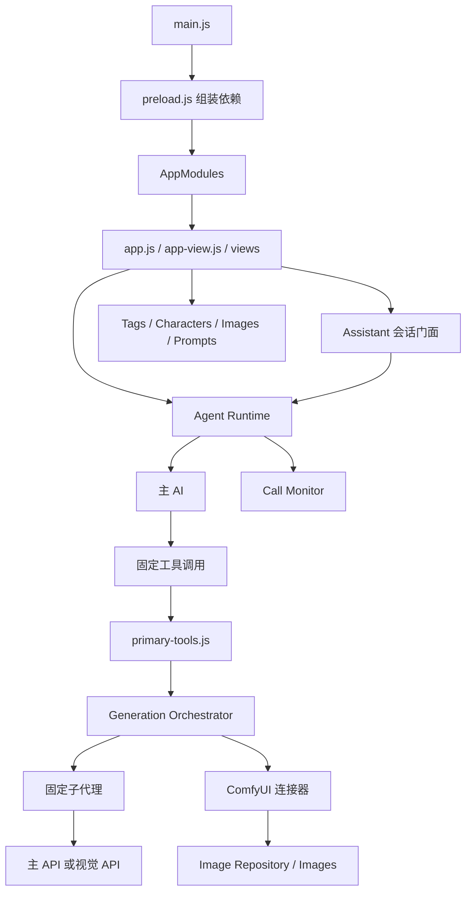
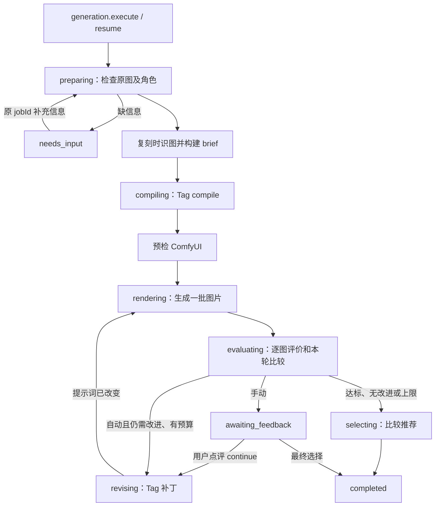
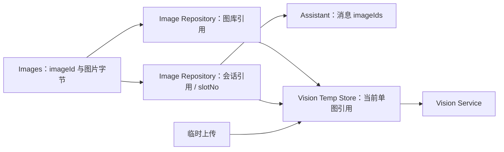
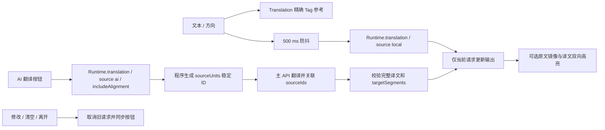

# AI 绘画 Tag 工具箱：当前架构与模块关系

更新日期：2026-09-09。代码版本：**V1.4.238**。本文按当前源码核对，是后续开发的架构入口。

- 工作区：`F:\codex\ai-tag-characters`，分支 `feat/offline-characters-v198`。
- 桌面测试包：`C:\Users\admin\Desktop\AI绘画Tag工具箱V1.4.238`。
- 旧文档已原样保存到 [V1.4.91 架构历史](docs/history/architecture-v1.4.91.md)。其中 Calls、ai-runner、四模式、外部 Agent Server 等描述不再代表现状。
- 本文描述已经实现的行为。`docs/superpowers/specs/`、`docs/superpowers/plans/` 和旧任务书记录当时的设计及任务，不能代替当前源码。

## 1. 程序如何组成

这是一个 Electron 桌面模块化单体，使用 CommonJS 业务模块和原生 DOM 页面，没有独立业务服务器。

`main.js` 创建窗口，加载 `preload.js` 和 `src/index.html`。业务模块在 preload 的本地环境中创建，通过 `contextBridge` 暴露为 `window.AppModules`。`src/app.js` 调用 `AppView.create()` 和 `start()` 完成页面组装。

当前窗口启用 `contextIsolation`，关闭页面 `nodeIntegration`；preload 的 `sandbox` 为 false。AI HTTP 和 ComfyUI 请求由 preload 中的业务模块执行，不是主进程 IPC 转发。当前设置由 JSON Storage 保存，没有使用旧文档所述的 safeStorage 加密链路。

图中箭头表示调用或组装关系。主 AI 的工具调用由 Runtime 校验后经注册表执行；业务模块通过注入的函数互相调用，不是模型直接访问本机函数。

### 组装顺序

1. `preload.js` 创建 Storage、Tags、Characters、Images、Prompts 和本地识图/翻译适配器。
2. `createAssistant()` 创建 Settings、Comfy Profiles、会话仓库、Image Repository、Vision Temp Store、Call Monitor 和两个 AI Client。
3. Assistant 组装 Primary Agent、Vision Service、Fixed Subagents、Agent Runtime、Primary Tools、Generation Orchestrator。
4. 翻译模块在 Assistant 之后创建，通过 `translationProxyTarget.service` 接入固定翻译子代理的本地分支，避免循环构造依赖。
5. preload 暴露公开 API；页面绑定事件并根据快照渲染。生图状态机和图片物理存储没有直接暴露成页面可随意写入的对象。

## 2. 模块职责及状态所有权

下列路径相对于项目根目录。

| 文件 | 负责什么 | 主要依赖 / 状态 |
| --- | --- | --- |
| `main.js` | Electron 窗口、菜单和外链 | 不负责 AI 调度 |
| `preload.js` | 业务组装与页面 API 桥接 | 注入磁盘路径、模型、图片解析器 |
| `src/app.js` | 页面启动入口 | AppModules、AppView |
| `src/app-view.js` | 路由、普通 Tag、对话候选、识图交互及子视图组装 | DOM 临时状态、请求编号；持久状态经模块 API 访问 |
| `src/views/*-view.js` | 角色、图库、配置、提示词、状态及监视器子视图 | 模块 API；部分对话与通用事件仍在 app-view 中 |
| `src/views/translation-view.js` | 翻译请求、按钮状态、原文镜像与译文双向高亮 | 独立请求编号、映射和选区；切页取消通过 enter/leave 接线 |
| `src/modules/index.js` | 聚合导出业务模块工厂 | 供 preload 和 Node 测试加载 |
| `src/modules/storage.js` | 普通 JSON 键值、命名空间与可选 Blob 适配 | 文件适配器 / 内存；异步合并写文件 |
| `src/modules/tags.js` | 普通词库、分类、搜索、自定义词、手动选择 | 标签素材与 Storage |
| `src/modules/characters.js` | 角色目录、名称/作品检索、资料引用、独立角色选择 | Tags、角色 JSON、Storage；按需加载及搜索缓存 |
| `src/modules/images.js` | 图片字节、索引、元数据、预览及分析缓存 | Storage、图片目录、本地分析适配器 |
| `src/modules/image-repository.js` | 图库引用、对话图片引用、图片编号、孤儿文件生命周期 | Images、会话读写函数、Storage |
| `src/modules/vision-temp-store.js` | 单图识图工作区及临时图片 | 授权图片引用；不是对话附件队列 |
| `src/modules/vision.js` | 本地 WD/ONNX 识图 | 本机模型文件 |
| `src/modules/vision-service.js` | 单个 imageId 的 metadata/local/ai 识图 | Images、Vision Temp Store、本地识图、视觉 API、Prompts |
| `src/modules/vision-payload.js` | 解析识图 JSON / 文本，压缩公开结果 | 不保存完整 PNG workflow 到任务蓝图 |
| `src/modules/translation.js` | 本地模型翻译、词库映射、精确 Tag 参考 | Tags、注入的翻译 runner、结果缓存 |
| `src/modules/translation-alignment.js` | 原文稳定 ID 分段、JSON/文本返回解析、对照校验 | Node/浏览器共用纯函数；仅保留能无损拼接完整译文的映射 |
| `src/modules/settings.js` | 主 API、视觉 API、Comfy 参数、调用限制、生成策略 | Storage `settings`；表单与规范结构转换 |
| `src/modules/prompts.js` | 提示词组、扩展提示词、组合与导入导出 | Storage `rewrite_prompt_state`、提示词素材 |
| `src/modules/assistant.js` | 会话、消息、当前对话请求和面向页面的生成操作 | Settings、Runtime、Generation、Image Repository |
| `src/modules/primary-agent.js` | 主 AI 提示词与公开请求配置 | Prompts、主 AI Client |
| `src/modules/agent-runtime.js` | 主 AI 工具循环、工具调用、固定子代理执行 | Request/Status Manager、Usage Limiter、Monitor、注册表 |
| `src/modules/primary-tools.js` | 固定工具 schema、输入输出边界、handler | Tags、Characters、图片仓库、子代理、Generation、Comfy |
| `src/modules/fixed-subagents.js` | 四个固定子代理及 Tag compile/revise 协议 | Vision Service、Translation、主 API、视觉 API、Prompts |
| `src/modules/generation-orchestrator.js` | 生图状态机、轮次预算、评价/修订、暂停恢复、最终选择 | 注入的工具/子代理函数、Storage `generation_jobs` |
| `src/modules/candidate-evaluator.js` | 单图评价、候选比较、结构化评价校验 | 视觉 API、受控图片解析器、评估提示词 |
| `src/modules/generation-guidance.js` | 用户要求、原图观察、角色参考的共享使用规则 | Tag 编译/修订与评价共同使用 |
| `src/modules/prompt-patch.js` | 应用增删补丁、检测冲突和正向否定命令 | 纯函数；不决定角色外貌取舍 |
| `src/modules/draw-candidates.js` | 候选记录、评分、推荐、选择与最终提示词映射 | 纯候选数据操作 |
| `src/modules/comfy-profiles.js` | 工作流配置档、能力声明、绑定和覆盖开关 | Storage `comfy_profiles`，结构版本 2 |
| `src/modules/comfy-workflow.js` | API 工作流解析、候选节点分析、显式绑定校验/应用 | 纯工作流处理 |
| `src/modules/comfy.js` | ComfyUI HTTP、图片上传、提交/轮询/取消、工作流构建 | 当前配置档、fetch、本机 ComfyUI |
| `src/modules/ai-client.js` | OpenAI 兼容请求、流式解析、调用诊断 | 主 API 或视觉 API 配置 |
| `src/modules/request-manager.js` | 父子请求编号、超时、取消、生命周期 | AbortController；限制记录数量 |
| `src/modules/status-manager.js` | 运行状态快照和事件 | 供页面观察 |
| `src/modules/usage-limiter.js` | 工具回合/调用、生图次数、Token 汇总 | 按 rootRequestId 统计 |
| `src/modules/call-monitor.js` | 脱敏输入、返回、HTTP exchanges、事件、用量 | 有界记录与独立调试日志文件 |
| `src/modules/schema.js`、`error-manager.js` | 固定 schema 与错误信封 | 共享校验和错误格式 |

## 3. 主 AI、工具和子代理的分工

主 AI 负责对话、理解要求、检索不确定的 Tag/角色并发起高层任务。文生图 Tag 由子代理编译；识图、渲染、评价、修订和自动停止由程序调度。

### 主 AI 可见的 8 项工具

| 工具名 | 关键输入 | 返回用途 |
| --- | --- | --- |
| `tags.search` | query、category、limit | 普通词释义；角色词另带 attachedData |
| `characters.search` | query、seriesId、precision、limit（≤10） | 名称、出处、identityTags、generalTags、specificTags |
| `conversation.listImages` | includePending、includeDeleted | 当前会话真实 imageId、编号及元数据 |
| `vision.processOne` | imageId、mode | 单图识图；绘图请求禁止主 AI 提前用它改写原图事实 |
| `translation.translate` | text、direction、source、可选 includeAlignment | local / ai 翻译；对照仅在请求时返回 |
| `comfy.status` | 无 | enabled、connected、workflowReady、render 与能力信息 |
| `generation.execute` | originalRequirements、sourceImageId、characterIds / characterQueries | 新绘图/复刻任务的紧凑结果 |
| `generation.resume` | 原 jobId 及所缺信息，或 continue/feedback | 在原任务内恢复 |

另外注册但不下发给主 AI 的 3 项工具是 `agent.generateTags`、`comfy.validateWorkflow`、`comfy.render`，供内部链路使用。主模型请求里的函数名用下划线，例如 `generation_execute`；Runtime 映射回点号名。

当前没有旧版 `agent-tools` HTTP Server、Runtime/Admin 写权限开关或动态加载的外部 Agent。界面的“调用监视器”用于本地查看调试记录，不是对外服务端口。

### 四个固定子代理

| 子代理 | 使用的模型/能力 | 输入与输出 |
| --- | --- | --- |
| `vision` | 本地识图或视觉 API | 单个授权 imageId；返回观察/Tag，由 vision-payload 解析 |
| `translation` | 本地 Translation 或主 API Client | text、direction、source、includeAlignment；返回 text 等及可选 alignment |
| `generateTags` | 视觉 API Client，即便本次没有图片 | compile 返回 positiveTags；revise 返回 add/remove/preserve 补丁 |
| `evaluateImages` | 视觉 API Client | review 一张候选；compare 2–3 张；返回评分、问题、排序 |

子代理没有整个聊天历史，也没有自主工具循环。程序显式传入当前要求、资料、图片 ID 和必要评价。视觉 API 可独立配置或沿用主 API；因此“主 AI”和“Tag 子代理”是职责分离，不必是不同厂商模型。

## 4. 绘图与复刻状态机

失败、取消、应用重启还会产生 `failed`、`cancelled`、`interrupted`；最终选择处理中使用 `finishing`。状态机实际定义见 `JOB_STATES`。

- `originalRequirements` 保留用户原话。兼容字段 requirements 存在时也优先用原话。
- 复刻输入使用当前对话的 sourceImageId，或通过 sourceSlot 解析。构建 `brief` 时保留原图观察，并附带目标角色完整资料和参考用途标识。
- `generateTags.compile` 接收要求、蓝图、可选原图和 characterReferences。后续修订使用同样的目标角色参考及结构化评价。
- `evaluateImages.review` 和 `compare` 通过 brief 接收目标角色资料，不能把原图人物外貌误当成目标角色事实。
- 同一轮每张图单独评价，再选择本轮候选；最终比较各轮推荐候选。比较子代理每次最多看 3 张，由程序先按硬错误和评分筛选比较对象，并非一次向模型传入所有历史图片。
- 自动模式按预算与评价继续；手动模式每轮评价后等待用户输入，不自动修订 Tag。手动继续带 baseCandidateId 和 feedback。
- “最终选择”是终止操作；运行中会发出取消信号并调用 ComfyUI 中断，晚到产物不再进入任务结果。
- 相同正/负提示词指纹再次提交前会被阻止；空修订不会白白再生成相同图片。旧任务可从最后一轮/候选推导指纹。
- 当前界面保持**同轮图片横排，不同轮次上下分组**。用户在 2026-09-08 确认保留此布局。

### 预算与返回数据

对话页与 ComfyUI 配置页共用同一份设置：`imagesPerRound ↔ comfy.batchCount`，`maxAutoRounds ↔ limits.maxComfyCalls`，范围均为 1–10。关闭自动执行时自动轮次控件不可操作。

状态机区分成功轮次、图片数量和提交尝试次数。Runtime 的 comfyCalls 只在渲染工具成功后累计，识图/搜索不占这个生图次数；失败提交仍受状态机 maxRenderAttempts 限制。工具次数和主 AI 工具回合有另外的上限。

| 数据 | 拥有者 | 内容 |
| --- | --- | --- |
| Generation Job | Generation Orchestrator | jobId、sessionId、原要求、原图、角色、brief、policy、候选、轮次、停止原因 |
| Candidate | Job 中的 candidates | imageId、roundIndex/indexInRound、prompt/negative、参数、评价和选择状态 |
| UI Snapshot | Orchestrator `get/uiSnapshot` | 完整候选、评价、图片引用、实际提示词 |
| Public Result | Orchestrator `publicResult` | 精简候选摘要、最终提示词、outcome、needsInput、residualIssues |
| Message Result | Assistant | hydrated UI snapshot、请求错误与用量；保存在消息中供历史页面显示 |

`publicResult` 不包含完整 PNG metadata、工作流或图片字节。`best_available` 表示最佳可用候选仍未完全达标；`text_approximation` 表示原图未输入生成工作流；`user_selected_with_issues` 表示用户已选择且仍有问题。最终提示词取自被选候选，不另造一套 Tag。

任务保存 promptSnapshot 和工作流标识用于追踪，但当前子代理仍读取生效的提示词、连接器仍读取活动配置档；不要将这些标识误解为所有请求已经使用不可变配置快照。

## 5. 角色库与角色选择

角色数据位于 `assets/数据资产/角色/`。当前共 **34,122** 个可检索角色：33,599 个上游有特征角色及 523 个原词库补充角色；227 个通用新词并入普通词库，804 个角色专用词通过隐藏共享表引用。数据来自锁定版本的公开上游，不等同于 AniMadex 实时全量数据；没有导入角色缩略图。

| 数据字段 | 含义 |
| --- | --- |
| id、name、nameZh、aliases | 稳定角色 ID、中英文名和别名 |
| seriesId / seriesName | 作品出处，用于筛选和资料展示 |
| identityTags | 姓名和作品身份触发词 |
| generalTags | 引用普通词库的外貌等词，返回时展开为文本 |
| specificTags | 学校、阵营、专属服饰等隐藏共享词，返回时展开为文本 |

隐藏专用表不进入常规词库搜索，没有独立 AI 搜索工具。角色模块的选择单独保存，底部组合区汇总普通 Tag 与角色选择；删除角色选择不删除手动选择的同名普通词。

`tags.search` 给普通词返回空 `attachedData: {}`；命中角色名时返回 `type: character`、characterId、series、identityTags、appearanceTags。`characters.search` 返回更完整的角色资料。

多候选时生成任务进入 `needs_input.kind=character`。Runtime 结束本轮主 AI 工具循环，对话显示选择卡片，可重新本地搜索。点击卡片调用 `assistant.selectGenerationCharacter()`，程序使用消息保存的原 jobId 和待确认 query 调用 resume，不让主 AI 再抄写任务编号。逐项确认不会丢失其他待选角色；过期选择、重复点击和跨会话恢复会被拒绝。

已确认 characterIds 优先解析，重复角色名和其作品名不会再次触发消歧；唯一搜索结果还会按 ID 读取完整资料再送给子代理。

**外貌 Tag 是候选参考。**主 AI只传要求和角色 ID，程序展开资料；文生图子代理根据人数、景别、遮挡、可见范围和构图决定用哪些词。上半身可删靴子，多人可精简外貌；程序不永久锁定、强行补回外貌词。评价也不因可选词缺失而判错。用户明确要求改变发色、保留原图服装等时，用户要求优先。

## 6. 图片、图库、识图工作区

`imageId` 标识图片资源，`refId` 标识某个会话/图库引用，`slotNo` 是“图1”等显示编号；不可混用。Vision Temp Store 一次持有一张图，外部识图上传不自动加入对话。图生图输入必须先是授权会话图片。

删除对话默认同时移除对话图片引用；确认框勾选“保存图片到图库”后才先保留图库引用，默认不勾选。“清空对话区图片”有独立确认操作。仅当图片不再有图库、会话或消息引用时才删除物理资产。

## 7. ComfyUI 配置与执行边界

ComfyUI 有独立配置页，对话左上角齿轮进入该页；API 页负责模型地址和模型选择。

配置档包含 `workflow`、`analysis`、`bindings`、`overrides`、`capabilities` 和更新时间；Storage 的 `comfy_profiles` 是配置档主存储。普通参数在 Settings，完整活动工作流由配置档管理。

导入支持 API JSON、粘贴 JSON、包含 API 工作流的 PNG；UI 导出形式 `{nodes,links}` 不能直接执行，需要重新导出 API 格式。分析器提供主采样器、正负文本、尺寸、参考图片和输出节点候选；多采样器或不明确分支需要用户确认。未知节点仍在工作流中，不应通过猜测重写。

构建工作流会深拷贝原配置，先解析占位符，再应用显式绑定；没有显式绑定的旧标准工作流走采样器连接关系覆盖。显式绑定失效会在提交前报错。显式路径默认只开启正负提示词覆盖，其他参数需对应开关及绑定；旧占位符/自动覆盖路径仍有兼容行为，排查时要先确认使用哪条路径。

| ComfyUI 接口 | 用途 |
| --- | --- |
| `/system_stats`、`/queue` | 连接诊断、设备/版本/队列 |
| `/object_info` | 节点定义与分析缓存 |
| `/upload/image` | 有参考图绑定时上传授权原图 |
| `/prompt` | 提交构建后的 API 工作流，获得 prompt_id |
| `/history/{prompt_id}` | 轮询状态和选定输出节点 |
| `/view` | 下载本次结果并交给图片仓库 |
| `/interrupt` | 中断当前渲染 |

当前执行路径使用 HTTP 轮询，不以 WebSocket 为主。`sourceImage` 绑定及 img2img/controlImage 声明齐备才上传原图；否则是 text_approximation。匹配原图宽高比还要求明确可写的 width/height 绑定，否则保留工作流尺寸。mask 等能力字段不代表已实现通用蒙版生成接口。

`changedBindings: []` 在旧自动绑定路径中可能只表示诊断信息不足，不能单凭它断言提示词未写入；核对时应查看实际 ComfyUI history 的文本节点。

## 8. 翻译页面、请求状态与双向对照

- `translation-view.js` 负责翻译页请求和交互，`app-view.js` 只负责创建、绑定与路由 enter/leave。页面直接调用 `runtime.runSubAgent('translation', ...)`，不经过主 AI 的对话循环。
- local 分支经 Translation 模块调用本地 runner；本机缺模型或模型失败时可回退词库映射。ai 分支使用主 API Client 和当前翻译提示词。
- 页面“匹配到的站内 Tag”使用精确英文、中文及确认别名，避免子串误匹配。当前固定 AI 翻译子代理接收 text/direction/source/includeAlignment；页面展示的参考列表没有自动注入这个 AI 分支。Translation 中另有 `buildPrompt/translateWithAI` 辅助实现，不是该按钮实际走的入口。
- 当前按钮可用条件为：输入非空，且当前没有 AI 翻译请求。自动本地翻译不会禁用 AI 按钮。
- 输入或方向改变、清空和离开翻译页会取消原请求并使其结果失效；重新打开重新计算按钮状态，已有文本与已完成输出保留。
- 点击 AI 翻译会清除本地防抖任务；旧本地/AI 返回不能覆盖新的 AI 结果，也不能解锁新请求。请求成功、超时、错误和抛异常都在 finally 中释放对应按钮状态。
- 修复前代码只更新“本来没禁用”的按钮，空文本禁用后无法被新输入启用。页面缺少独立请求状态及返回时的状态同步，导致反复打开仍不可点。

### 对照数据与界面

AI 翻译按钮提交 `includeAlignment: true`。程序按 Tag 或词生成最多 256 个 `sourceUnits`；超过上限后按分句、必要时合并为块，保留完整原文。位置由程序计算，AI 只接收原文、方向与 `{ id, text }`，按译文顺序返回 `targetSegments: [{ text, sourceIds }]`。重复词拥有不同 ID，支持语序变化、一对多和多对一。方向 auto 在程序中解析后明确传入对照请求。

`translation-alignment.js` 解析模型返回的 JSON、代码块或普通文本，校验 ID、顺序与片段拼接。模型片段漏掉的连续标点或空白会按译文原样补成空 sourceIds 片段；缺失语义文字、顺序不一致或超过上限仍使映射无效。至少存在一处有效关联时才返回 `alignment`；无效 ID 被过滤，整体映射不可用则仅保留 `text`。没有对照时不自动额外调用 AI 修复；该能力不会改变主 AI 对话调用的默认返回。

页面保留可编辑 textarea，在其背后绘制透明原文镜像，译文以纯文本片段展示。悬停临时高亮、点击固定高亮、选中文字双向高亮，Esc 清除。selectionchange 先判断选区是否落在译文容器，避免浏览器焦点仍在原文输入框时误判。两侧仅沿直接关联定位，不通过共享片段继续扩大选区。原文滚动及窗口尺寸变化同步镜像；全部结果通过 textContent/text node 写入，模型输出不会作为 HTML 执行。复制按钮始终读取完整纯译文，包括原有空格与换行。

修改原文、切换方向或清空时立即废弃旧映射；离开页面取消未完成请求，已完成译文与映射可保留，返回后重新同步布局。对照关系只属于本次翻译页面，不写入 Tag 词库或持久存储。本地翻译和没有有效对照的 AI 返回继续显示普通译文。映射语义精度取决于模型，程序不伪造缺失关系。

## 9. 提示词来源与优先规则

主提示词组固定 6 项：primary、generateTags、artistQuality、vision、candidateEvaluation、translation。可以整体切换、导入导出，也可编辑单项；新建组含 6 个空白条目。扩展提示词独立管理，常驻或按关键词命中，**仅进入主 AI**。

实际请求组装时会追加程序协议：

- Primary Agent 追加高层调度和角色查询协议。
- Tag 编译/修订与 Candidate Evaluator 共享 generation-guidance。
- JSON 格式、固定输入输出及负面 Tag 开关受程序约束。
- 翻译请求启用 includeAlignment 时追加稳定 ID 对照协议；已有自定义翻译提示词也会收到该协议。
- 修改默认素材不会覆盖用户已保存的自定义提示词；共享程序协议在调用时追加，因此保存的旧组也能收到新规则。

用户原话及明确反馈优先于角色资料、原图观察和此前评价。原图的 `mustPreserve` 是观察建议，不自动变成用户硬约束。`preserve` 只在当前补丁内有效，不能形成永久 Tag 锁定；补丁检测互斥词和正向 remove/no/not 类自然语言否定命令。词库确有的 `no humans` 等允许项另行处理。

## 10. 持久化、事件和调试

桌面版固定用户目录为 `%APPDATA%\ai-tag-toolbox-rewrite`，版本更新不通过复制桌面应用覆盖该目录。

| 路径 / Storage 键 | 保存内容 |
| --- | --- |
| `rewrite-storage.json` | 带命名空间的普通状态 |
| `settings` | 模型、Comfy 普通参数、限制及生成策略 |
| `sessions` | 对话及消息，格式 ai-tag-sessions / version 1 |
| `generation_jobs` | 生成任务、候选和阶段状态 |
| `comfy_profiles` | 配置档 version 2 |
| `rewrite_prompt_state` | 提示词组与扩展 version 3 |
| `rewrite_character_selection_v1` | 角色独立选择 |
| `images_index`、图库/会话引用键 | 图片元数据及关联关系 |
| `rewrite-images/*.bin` | 图片字节；不是将所有图片塞进普通配置 |
| `debug/ai-calls.json` | 脱敏调用监视器记录 |

具体键名前缀由 Storage 添加，桌面配置一般为 `ai-tag-toolbox-rewrite:app:`。文件写入合并并异步落盘，内存立即更新；读取旧文件时也可能看到早期版本遗留键，不能把旧 `rewrite_settings` 等直接当作当前运行快照。

Runtime 用 requestId / parentRequestId / rootRequestId 串起主 AI、工具和子代理。Token 累计按根任务统计并包含 Vision、Tag、评价等子代理。监视器某条记录的 usage 是该时刻根任务累计量，不能把每条累计值相加当总消耗。

常见事件包括 generation.started、source.inspected、prompt.compiled、candidate.ready、candidate.evaluated、prompt.revised、generation.needs_input、generation.awaiting_feedback、generation.completed。流式小碎片节流，队列轮询按变化去重。

监视器最多保留 200 条 / 12 MB，截断会标记。诊断副本隐藏密钥、图片像素及本地路径，不改变真实业务请求。弹窗记录列表和长 JSON 独立滚动，顶部筛选/导出操作固定。清空监视器不删除对话或图片。

## 11. 检查、交付与后续维护

`npm run check` 当前依次执行 `scripts/check.mjs`、`node --test tests/*.test.cjs`、`tests/regressions-v194.cjs`；包含架构护栏、模块行为和 jsdom 页面事件测试。V1.4.238 共 **172 项通过**，覆盖翻译关闭思维链、服务商 reasoning 隔离、缺失逗号恢复和原文/译文选区双向高亮；另用真实 Edge 浏览器验证两侧高亮背景色。它不是逐个启动真实 API、ComfyUI 或 Electron 的完整测试，也不能等同于独立完整 ESLint/全源码语法遍历。

遵照本项目工作准则：每项改动独立中文提交，内部版不 push。默认不跑 --uitest、--smoke 等启动应用测试；本轮翻译交互和文档更新使用快速检查，留给用户人工测试。版本标识在 package.json、VERSION.txt、src/index.html、Electron 标题和 preload 统一。

桌面交付须包含对应版本 EXE、Electron 运行时、模型/依赖、app/ 源码、resources/app/ 源码和 resources/app.asar；原生模块必须 unpack。最终用 build-info.json 记录提交、归档哈希与检查证据。桌面只保留最终测试版，旧目录移出桌面备份。

每次更改模块调用、状态归属、提示词协议、工具 schema 或存储格式，都同步本文对应章节和 README；纯视觉小改可只写版本交付说明。历史文档保留原始内容，顶部明确链接到本文，不继续冒充“当前架构”。

### 已知边界与后续候选

以下仅记录现状，不属于本轮新增实施范围：

1. `app-view.js` 仍承担大量对话和通用控件逻辑，子视图提取尚不完整；翻译交互已独立到 translation-view。
2. 配置快照追踪与实际活动配置读取仍有差别；历史参数摘要也不能替代 ComfyUI 实际提交节点检查。
3. 角色库无缩略图，隐藏词只用于角色引用；普通收藏格式未覆盖完整角色选择。
4. 一次模型比较最多 3 张，复杂工作流参考图与尺寸需要明确绑定。真实效果仍由模型能力和工作流决定。
5. AI 翻译参考列表注入、细化历史配置迁移、更多非图片工作流产物等需单独提出与验证，不能因文档提到就自动宣称已完成。

本次交付说明：[V1.4.238](交付说明-V1.4.238.md)。提示词组接口详见 [Prompts README](src/modules/prompts.README.md)。
